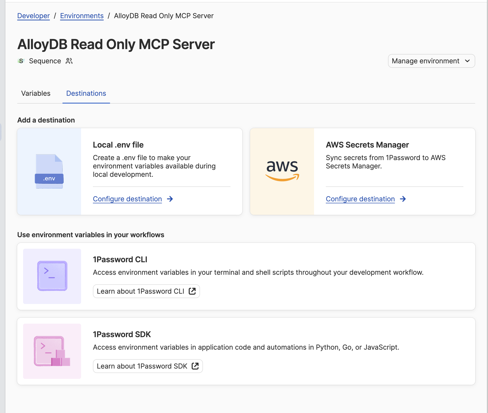
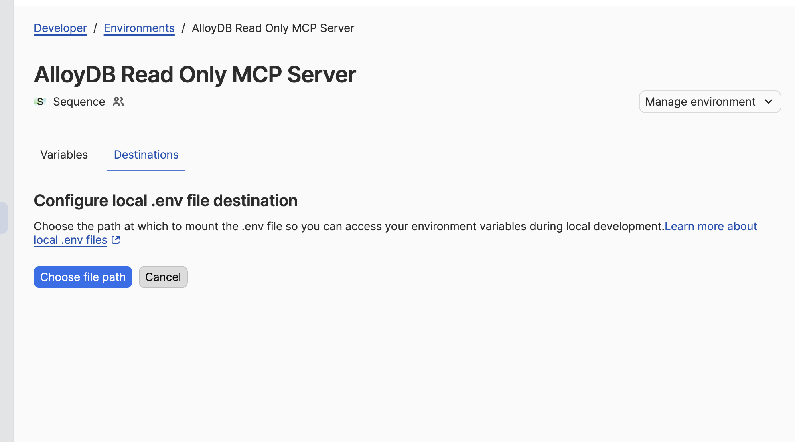
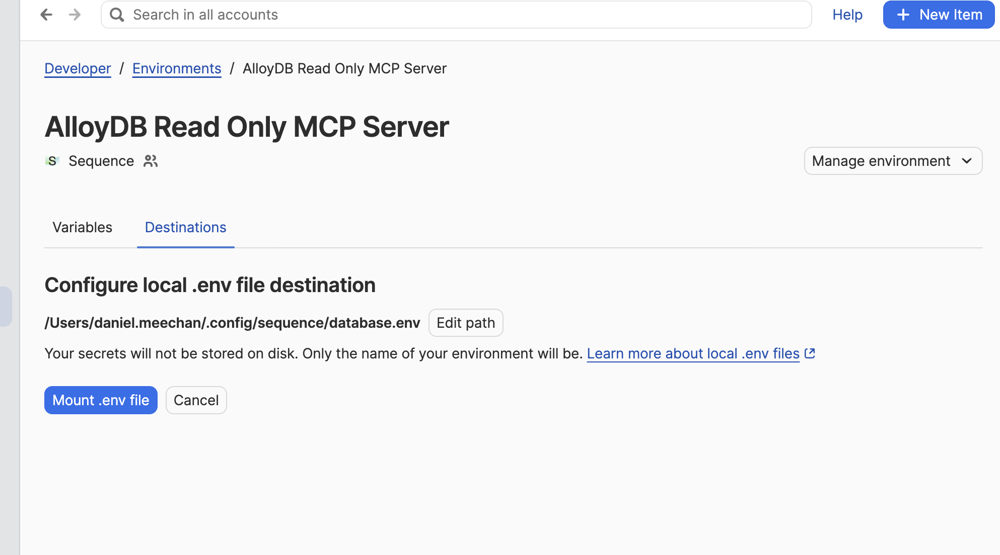

# claude-marketplace

All the Sequence specific Claude skills, commands and agents

## Installation 

* Start up your Claude Code instance 
* Add the plugin marketplace 

```bash
$ claude plugin marketplace add sequencehq/claude-marketplace
```

* Install the `sequence` plugin 

```bash
$ claude plugin install sequence@sequence-marketplace
```


## Plugins 

### `sequence`

### `sequence-linear`

A shortcut for setting up the [Linear](https://linear.app/) MCP server

```bash 
$ claude plugin install sequence-linear@sequence-marketplace
```

### `sequence-notion`

A shortcut for setting up the [Notion](https://www.notion.so/) MCP server

```bash
$ claude plugin install sequence-notion@sequence-marketplace
```

### `sequence-logs`

MCP server for querying GCP Cloud Logging across dev, sandbox, and production environments.

```bash
$ claude plugin install sequence-logs@sequence-marketplace
```

### `sequence-database`

MCP server for querying AlloyDB read replicas across dev, sandbox, and production environments. Provides tools to execute read-only SQL queries, explore database schemas, and inspect table structures.

```bash
$ claude plugin install sequence-database@sequence-marketplace
```

**Prerequisites:**

1. Install and authenticate Cloudflare Access (the MCP server will automatically start tunnels when needed):

```bash
brew install cloudflared
cloudflared login
```

2. Set up database credentials via 1Password. The MCP server reads credentials from `~/.config/sequence/database.env` (not from shell environment variables). This file is provisioned automatically by 1Password — follow the steps below to set it up.

**Setting up 1Password credential provisioning:**

First, ensure the destination file path exists:

```bash
mkdir -p ~/.config/sequence && touch ~/.config/sequence/database.env
```

Then configure 1Password to provision credentials to that file:

   1. Open **1Password** and navigate to **Developer → Environments**
      (You may need to turn on developer settings - https://developer.1password.com/docs/environments/#turn-on-1password-developer)
   2. Select the **AlloyDB Read Only MCP Server** environment (engineers should have read access — if not, request access in the [#help-it](https://sequenceslack.slack.com/channels/help-it) Slack channel)
   3. Select the **Destinations** tab, then click **Configure destination** on the **Local .env file** card

   

   4. Click **Choose file path** and select your `~/.config/sequence/database.env` file (you may need to press `Cmd + Shift + .` to show hidden folders like `.config`)

   

   5. Select **Override file**, then click **Mount .env file**

   

This will automatically provision and keep up to date the following variables in `~/.config/sequence/database.env`:

```
DB_DEV_READ_USER=<dev read-only username>
DB_DEV_READ_PASSWORD=<dev read-only password>
DB_SANDBOX_READ_USER=<sandbox read-only username>
DB_SANDBOX_READ_PASSWORD=<sandbox read-only password>
DB_PRODUCTION_READ_USER=<production read-only username>
DB_PRODUCTION_READ_PASSWORD=<production read-only password>
```

Each environment requires its own read-specific credentials. The `READ` suffix ensures only read-replica credentials are used — the MCP server deliberately does **not** read credentials from `process.env` to prevent write-access credentials from leaking in.

**Database names** (usually no need to set — defaults are correct):

| Environment | Default Database |
|-------------|------------------|
| dev | `dev-db` |
| sandbox | `sandbox-db` |
| production | `production-eu-db` |

Override with `DB_DEV_DATABASE`, `DB_SANDBOX_DATABASE`, or `DB_PRODUCTION_DATABASE` environment variables.
