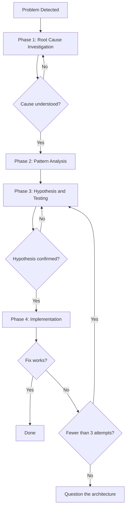
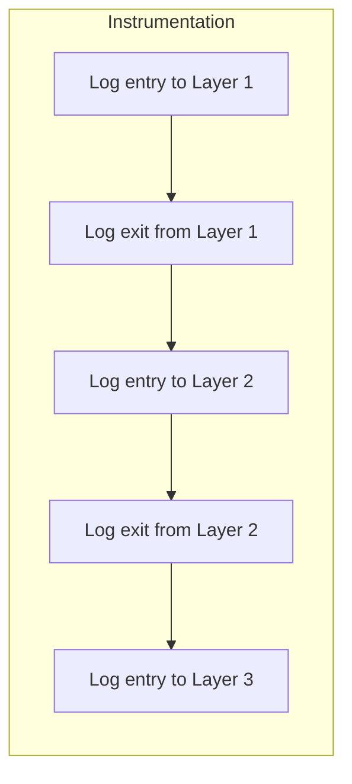
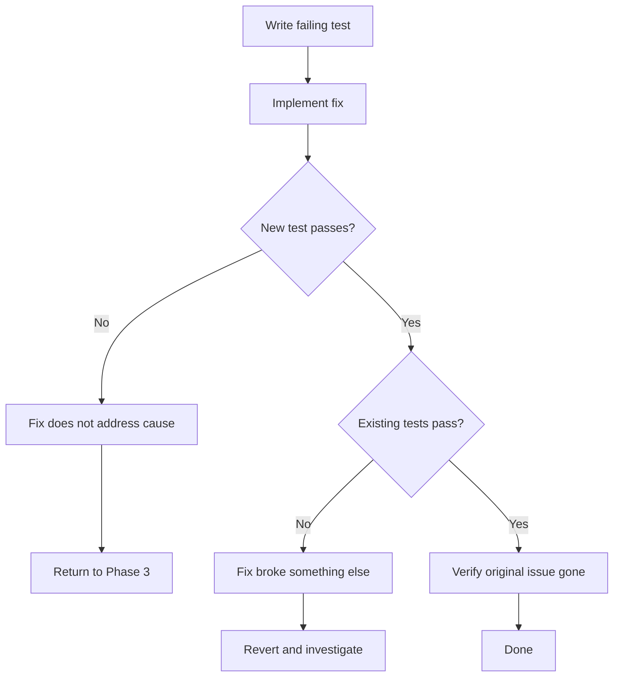

# Debugging

## Principle

Guessing creates more bugs than it solves. Patching symptoms hides the real problem.

**Find the root cause first. Always.**

Skipping investigation to save time guarantees wasted time.

## The Rule

```
NO FIXES UNTIL YOU UNDERSTAND THE CAUSE
```

You cannot propose a fix until Phase 1 is complete.

## When to Apply

Any technical problem: test failures, production bugs, unexpected behaviour, performance issues, build failures, integration problems.

**Especially when:**
- Time pressure makes shortcuts tempting
- The fix looks obvious
- You have already tried something that did not work
- You cannot explain why it broke

**Do not skip when:**
- The issue looks simple (simple bugs have causes too)
- Someone wants it fixed immediately (rigour beats thrashing)
- You are confident (confidence without evidence is guessing)

## The Four Phases



Complete each phase before moving to the next.

---

### Phase 1: Root Cause Investigation

Before attempting any fix:

**Read error messages properly**

Do not skim. Errors frequently contain the answer. Read stack traces fully. Note line numbers, file paths, and error codes.

**Reproduce reliably**

Can you trigger it consistently? What are the exact steps? If reproduction is inconsistent, gather more data before proceeding.

**Check what changed**

```bash
git log --oneline -10
git diff HEAD~5
```

What is different from when it worked? New dependencies, configuration changes, environmental differences?

**Trace data flow**

When the error appears deep in the stack, trace backwards:


Find where the bad value enters the system. Fix at the source.

**Instrument multi-component systems**

When the system spans multiple layers (CI → build → deploy, API → service → database):



Add logging at each component boundary. Run once. The point where data becomes wrong reveals the failing component.

---

### Phase 2: Pattern Analysis

Before proposing solutions, understand the pattern.

**Find working examples**

Locate similar code in the codebase that works. What succeeds that resembles what fails?

**Read references completely**

If implementing a known pattern, read the reference implementation in full. Do not skim. Partial understanding produces bugs.

**Identify differences**

What differs between working and broken? List everything, including details that seem irrelevant. Do not assume something cannot matter.

**Map dependencies**

What does this code require? What configuration, environment, or state must exist? What assumptions does it make?

---

### Phase 3: Hypothesis and Testing

Apply the scientific method.

**Form a single hypothesis**

State it explicitly: "I believe X causes this because Y."

Be specific. Write it down.

**Test minimally**

Make the smallest change that tests your hypothesis. One variable at a time. Do not bundle multiple changes.

**Evaluate and iterate**

Did it confirm your hypothesis? Proceed to Phase 4.

Did it disprove your hypothesis? Form a new one. Do not layer more changes on top.

**When uncertain**

State what you do not understand. Ask for help. Research further. Do not pretend to know.

---

### Phase 4: Implementation

Fix the root cause, not the symptom.

**Write a failing test first**

Create the simplest reproduction that fails. Automated if possible. This test must exist before you write the fix.

**Implement a single fix**

Address the root cause you identified. One change. No opportunistic improvements. No bundled refactoring.

**Verify completely**

- Does the new test pass?
- Do all existing tests pass?
- Is the original issue actually resolved?



**After three failed attempts**

Stop. Three failures indicate you are fixing the wrong thing.

Signs of an architectural problem:
- Each fix exposes a new issue elsewhere
- Fixes require large-scale changes to implement
- Symptoms shift but do not disappear

Question the design itself. Discuss before attempting fix number four.

---

## Red Flags

These thoughts mean stop and return to Phase 1:

- "Quick fix now, investigate later"
- "Let me try this and see"
- "I will test multiple changes at once"
- "Skip the test, I will verify manually"
- "It is probably X"
- "I do not fully understand, but this might work"
- "One more attempt" (after two failures)

If you catch yourself thinking any of these, you are guessing.

## Common Rationalisations

| Excuse | Reality |
|--------|---------|
| "Too simple to need process" | Simple bugs have root causes. Process handles them quickly. |
| "No time, it is urgent" | Methodical debugging is faster than thrashing. |
| "Let me try this first" | The first fix sets the pattern. Start correctly. |
| "I will write the test after" | Untested fixes do not hold. Test first. |
| "Multiple changes saves time" | You cannot isolate what worked. You risk new bugs. |
| "I see the problem" | Seeing symptoms is not understanding the cause. |
| "One more try" (after 2+ failures) | Three failures means wrong target. Reassess. |

## Quick Reference

| Phase | Activities | Complete when |
|-------|-----------|---------------|
| 1. Root Cause | Read errors, reproduce, check changes, trace flow | You understand what and why |
| 2. Pattern | Find working examples, compare, map dependencies | You know what differs |
| 3. Hypothesis | Form theory, test minimally, evaluate | Hypothesis confirmed |
| 4. Implementation | Write test, single fix, verify | Bug resolved, tests pass |

## When Investigation Finds Nothing

If thorough investigation reveals the issue is environmental, timing-dependent, or external:

- Document what you investigated
- Implement appropriate handling (retry logic, timeouts, error messages)
- Add logging for future diagnosis

Note: most "no root cause" conclusions come from incomplete investigation.
