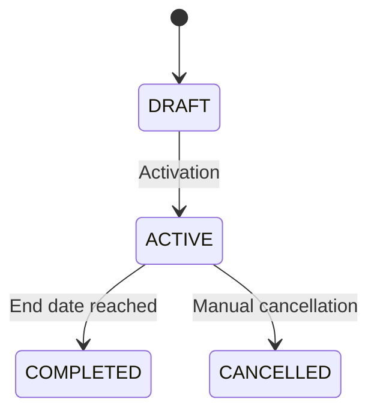
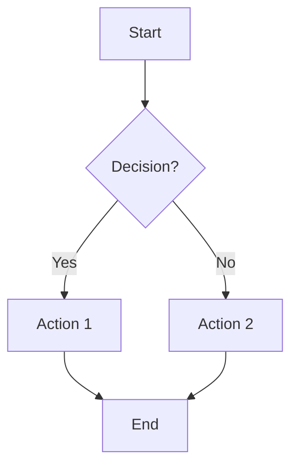
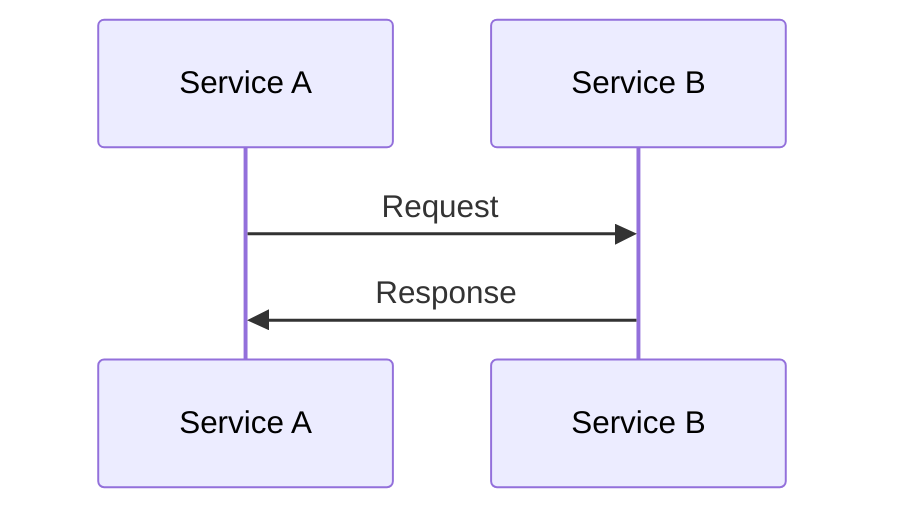

# Formatting Reference

This file contains the formatting patterns to use when writing documentation.

## Document Structure

Every specification document follows this structure:

```markdown
[← Back to Index](./index.md)

## N. Topic Name

[Introductory paragraph: 2-3 sentences explaining what this concept is and why it matters]

### N.1 Subsection Title

[Content with scenarios, tables, and diagrams as needed]

---

[← Previous Section](./previous.md) | [Next Section →](./next.md)
```

## Given/When/Then Scenarios

Scenarios define exact behaviour the system must exhibit:

```markdown
**Scenario: Descriptive name in sentence case**

* **Given** [precondition or context]
* **When** [action or event occurs]
* **Then** [expected outcome]
  * And [additional outcome]
  * And [another outcome]
```

**Rules:**

- Use asterisks (`*`) for bullets, not dashes
- Bold the keywords: `**Given**`, `**When**`, `**Then**`
- Use `* And` for additional conditions (indented under Then)
- Scenario name should describe the behaviour being specified
- Avoid implementation details - focus on observable behaviour

## Tables

Use tables for configuration options, field definitions, and comparisons.

**Configuration fields:**

```markdown
| Field | Purpose |
|-------|---------|
| Status | Current lifecycle state |
| Start Date | The date when billing begins |
```

**With types:**

```markdown
| Field | Type | Description |
|-------|------|-------------|
| price | Decimal | The amount charged |
| quantity | BigDecimal | Number of units |
```

**State transitions:**

```markdown
| From | To | Trigger | Description |
|------|----|---------|-------------|
| DRAFT | ACTIVE | Manual activation | User activates the schedule |
```

## Mermaid Diagrams

Use diagrams for state machines, process flows, and sequences.

**State diagrams:**



**Flowcharts:**



**Sequence diagrams:**



## User Story Template

Each documentation user story should follow this pattern:

```markdown
### [ ] **Ticket: Document [Feature Name]**

**As a** developer onboarding to the system
**I want** comprehensive documentation of [feature]
**So that** I can understand the behaviour without reading the code

**Context**: [What this feature does and why it matters]

**Acceptance Criteria**:
- [ ] Overview section explains what the feature is and why it matters
- [ ] All configuration options documented in tables
- [ ] Given/When/Then scenarios cover all distinct behaviours
- [ ] State diagrams show lifecycle transitions (if applicable)
- [ ] Flowcharts show process flows (if applicable)
- [ ] Examples use concrete values (amounts, dates, names)
- [ ] Navigation links to previous/next sections

**Definition of Done**:
- [ ] Documentation file created in docs/specs/
- [ ] All acceptance criteria met
- [ ] Committed to git
```
