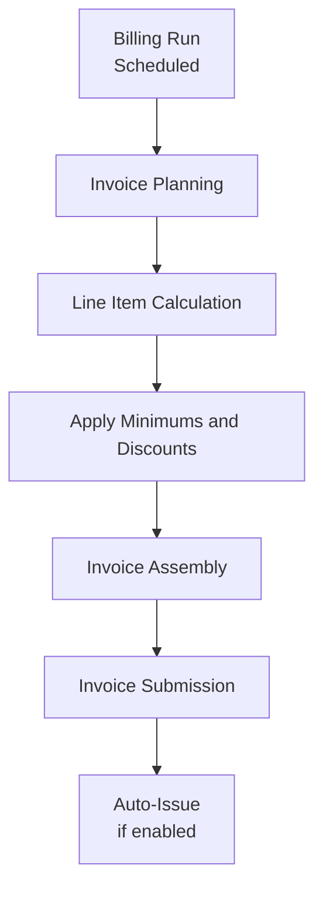
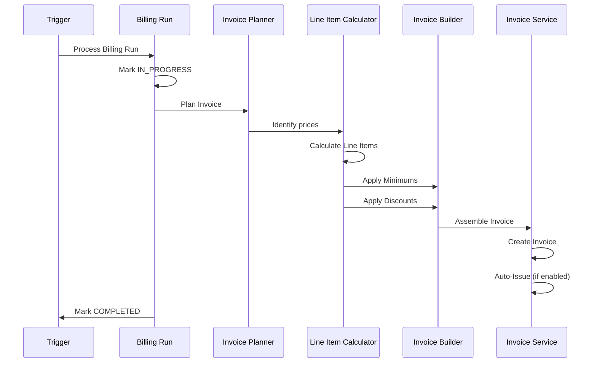

# Example: Process Documentation

This example shows how to document a process with flow diagrams and step-by-step scenarios.

```markdown
[← Back to Index](./index.md)

## 5. Invoice Creation Process

Invoices are the tangible output of the billing engine. They represent the financial documents sent to customers, detailing what they owe for services rendered or to be rendered. Understanding how invoices are created from billing schedules is essential for troubleshooting billing issues and extending the system.

### 5.1 Overview of the Invoice Creation Flow

The invoice creation process transforms billing schedule configurations into customer-facing invoices through a series of orchestrated steps.



**Scenario: Complete invoice creation pipeline from billing run to auto-issue**

* **Given** a billing schedule with active prices and a scheduled billing run
* **When** the billing run is processed
* **Then** the system plans which prices to include
  * And calculates line items for each price
  * And applies minimums and discounts
  * And assembles the invoice with all line items
  * And submits the invoice to the invoice service
  * And optionally auto-issues the invoice to the customer

### 5.2 Step 1: Billing Run Processing

The billing run is the trigger that initiates invoice creation. Each billing run represents a specific billing period for a billing schedule.

#### Billing Run Status Transitions

| Status | Description |
|--------|-------------|
| SCHEDULED | Initial state - the billing run is waiting for its scheduled time |
| IN_PROGRESS | Processing has begun - invoice creation is underway |
| COMPLETED | Processing finished successfully - invoice has been created |
| FAILED | Processing encountered an error - requires investigation |

**Scenario: Billing run transitions to in-progress when processing time arrives**

* **Given** a billing run in SCHEDULED status
* **When** the processing time arrives
* **Then** the status transitions to IN_PROGRESS
  * And the invoice creation pipeline begins

**Scenario: Duplicate processing requests are ignored**

* **Given** a billing run already in IN_PROGRESS status
* **When** a duplicate processing request arrives
* **Then** the duplicate request is ignored
  * And only one invoice is created per billing run

### 5.3 Step 2: Invoice Planning

Before generating line items, the system creates an invoice plan that determines exactly what will be billed.

**Scenario: Single phase price included in invoice plan**

* **Given** a billing schedule with Phase A (Jan 1 - Mar 31) containing Price X
* **When** a billing run for February is processed
* **Then** the invoice plan includes Price X
  * And the service period for Price X is February 1-28

**Scenario: Multiple phases within billing period split service periods**

* **Given** a billing schedule with Phase A ending Feb 14 and Phase B starting Feb 15
* **When** a billing run for February is processed
* **Then** the invoice plan includes prices from both phases
  * And Phase A prices have service period Feb 1-14
  * And Phase B prices have service period Feb 15-28

### 5.4 Invoice Creation Sequence



### 5.5 Complete Example

Consider a customer with a simple monthly subscription:

```
Billing Schedule:
  Customer: Acme Corp
  Start Date: 2024-01-01
  Recurrence Day of Month: 1
  Auto Issue: true

  Phase 1:
    Prices:
      - "Pro Plan" - Fixed $299/month, billed in advance
```

**Scenario: Monthly fixed price invoice creation end-to-end**

* **Given** this billing schedule configuration
* **When** the February billing run is processed
* **Then** the billing run transitions to IN_PROGRESS
  * And the invoice plan includes "Pro Plan" price
  * And one line item is created: "Pro Plan", $299, quantity 1
  * And the invoice is assembled with billing period Feb 1-28
  * And the invoice is created and auto-issued
  * And the customer receives a $299 invoice

---

[← Previous Section](./04-phase-recurrence.md) | [Next Section →](./06-billing-runs.md)
```
