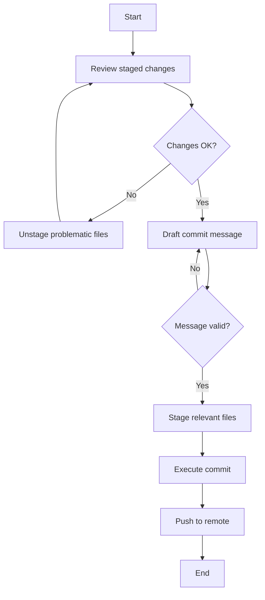
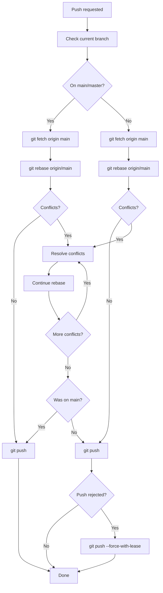
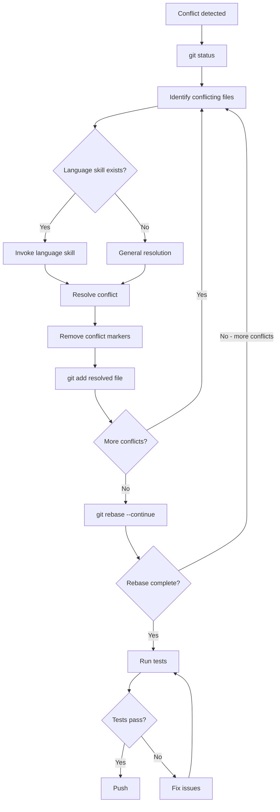

# Git Commit Skill


**CRITICAL REQUIREMENT**: This skill MUST be invoked BEFORE every command that interacts with `git`. No exceptions.

This skill enforces Conventional Commits standards and ensures commit quality. It validates commit messages, reviews staged changes, and prevents common commit mistakes.

## Commit Message Format

**Required format:** `type(scope): description`

### Types (Required)
- `feat`: New feature
- `fix`: Bug fix
- `docs`: Documentation only
- `style`: Code style changes (formatting, missing semicolons, etc.)
- `refactor`: Code change that neither fixes a bug nor adds a feature
- `perf`: Performance improvement
- `test`: Adding or updating tests
- `build`: Changes to build system or dependencies
- `ci`: CI/CD configuration changes
- `chore`: Other changes that don't modify src or test files
- `revert`: Reverts a previous commit

### Scope (Optional but Recommended)
- Component, module, or area affected
- Examples: `auth`, `api`, `parser`, `ui`, `database`
- Use `*` for changes affecting multiple scopes

### Description (Required)
- Imperative mood: "add" not "added" or "adds"
- Uppercase first letter
- No period at the end
- Max 72 characters for first line
- Clearly describe what changed, not why

### Body (Optional)
- Separate from subject with blank line
- Explain what and why, not how
- Wrap at 72 characters
- Use bullet points for multiple items

### Footer (Optional)
- Breaking changes: `BREAKING CHANGE: description`
- Issue references: `Fixes #123`, `Closes #456`
- Co-authors: `Co-authored-by: Name <email>`

## Examples

### Good
```
feat(auth): add OAuth2 authentication

Implement OAuth2 flow with Google and GitHub providers.
Includes token refresh logic and session management.

Fixes #234
```

```
fix(parser): handle null values in JSON parsing

Previously crashed on null; now returns empty object.
```

```
docs: update API endpoint documentation
```

### Bad
```
❌ Updated the thing
   → No type, vague description

❌ feat: Added new feature.
   → Wrong mood ("Added" should be "add"), unnecessary period

❌ fix(auth): fixed the bug where users couldn't login because the token was expired
   → Too long (>72 chars), redundant info

❌ WIP
   → Meaningless, don't commit WIP
```

## Commit Quality Checks

Before committing, verify:

1. **One logical change per commit**
   - Don't bundle unrelated changes
   - If using "and" in description, probably should be multiple commits

2. **Commit actually works**
   - Code compiles/runs
   - Tests pass (if applicable)
   - No debug statements or commented code

3. **Meaningful scope**
   - Small, focused changes
   - Easy to review and revert if needed
   - Atomic: commit should leave codebase in working state

4. **No secrets or sensitive data**
   - API keys, tokens, passwords
   - Personal information
   - Internal URLs or infrastructure details

## Enforcement Rules

**Hard rejections:**
- Missing type
- Description over 72 characters
- Non-imperative mood in common cases ("added", "fixed", "updated")
- Obvious placeholder messages ("wip", "temp", "asdf", "fix", "stuff")
- Secrets detected in diff

**Warnings:**
- Missing scope when it would be helpful
- Body missing when change is non-trivial
- Breaking change without `BREAKING CHANGE:` footer
- Multiple unrelated changes in one commit

## Mandatory Commit Workflow



**BEFORE EVERY GIT COMMIT, YOU MUST:**


### Step 1: Review Staged Changes
```bash
git diff --cached --stat
git diff --cached
```

Verify:
- [ ] All staged files are intentional
- [ ] No unrelated changes included
- [ ] No secrets, API keys, or sensitive data
- [ ] No debug statements or console.logs
- [ ] No commented-out code blocks
- [ ] No .md files unless explicitly required (user stories, plans, etc. should NOT be committed)

### Step 2: Draft Commit Message

Follow the format: `type(scope): description`

**Types:**
- `feat` - New feature
- `fix` - Bug fix
- `docs` - Documentation
- `refactor` - Code refactoring
- `test` - Tests
- `chore` - Maintenance

**Description:**
- Imperative mood: "add" not "added"
- Uppercase first letter
- No period at end
- Max 72 characters

### Step 3: Validate Message

Check against enforcement rules:
- ✓ Has valid type
- ✓ Description ≤ 72 characters
- ✓ Imperative mood
- ✓ Not a placeholder ("wip", "temp", "fix")
- ✓ Scope included (if applicable)
- ✓ Body explains complex changes
- ✓ BREAKING CHANGE footer if needed

### Step 4: Stage the changes

**NEVER use `git add -A` or `git add .`** - these commands stage everything indiscriminately.

Only stage files relevant to the current logical change:
```bash
git add path/to/specific/file.ts
git add path/to/another/file.ts
```

Verify what you're staging:
```bash
git status
```

If you accidentally staged something wrong:
```bash
git reset HEAD path/to/wrong/file.ts
```

**Rules:**
- Stage files one by one or in small related groups
- Each staged file must relate to the commit's purpose
- Unrelated changes go in separate commits
- When in doubt, leave it out

### Step 5: Execute Commit

Only after validation passes:
```bash
git commit -m "type(scope): description"
```

Or for commits with body:
```bash
git commit -m "$(cat <<'EOF'
type(scope): description

Detailed explanation of what and why.
Can span multiple lines.

BREAKING CHANGE: description (if applicable)
Fixes #123 (if applicable)
Co-Authored-By: Name <email> (if applicable)
EOF
)"
```

### Step 6: Push to Remote



Before pushing, check if you're on a feature branch:

```bash
git branch --show-current
```

**If on main/master:** Rebase from origin before pushing.

```bash
git fetch origin main
git rebase origin/main
git push
```

**If on a feature branch:** Rebase onto main before pushing.

```bash
git fetch origin main
git rebase origin/main
```

If rebase succeeds, try a normal push first:
```bash
git push
```

If push is rejected (remote has diverged), only then use force-with-lease:
```bash
git push --force-with-lease
```

**NEVER use --force or --force-with-lease on main/master.** If main cannot be pushed normally, stop and investigate.

**If rebase has conflicts:**



1. Identify conflicting files:
```bash
git status
```

2. For each conflicting file, check if a language-specific skill exists for that file type. If so, invoke it to help with conflict resolution following language idioms and patterns.

3. Open each conflicting file and resolve conflicts:
   - Remove conflict markers (`<<<<<<<`, `=======`, `>>>>>>>`)
   - Choose the correct code or merge both changes logically
   - Ensure the result compiles and tests pass

4. After resolving each file:
```bash
git add path/to/resolved/file
```

5. Continue the rebase:
```bash
git rebase --continue
```

6. If conflicts are too complex or you need to abort:
```bash
git rebase --abort
```

7. After successful rebase, try normal push first:
```bash
git push
```

8. Only if push is rejected on a feature branch, use force-with-lease:
```bash
git push --force-with-lease
```

**NEVER force push to main/master.** If you're on main and push fails after rebase, abort and investigate.

**Conflict Resolution Rules:**
- Never blindly accept "ours" or "theirs" without understanding the change
- Run tests after resolving conflicts to verify correctness
- If unsure about a conflict, ask the user before proceeding
- Preserve the intent of both changes when possible

**Workflow:**
1. Detect commit intent or staged files
2. Review or add staged changes thoroughly
3. Draft and validate commit message
4. Provide commit message to user for review
5. Execute commit only after validation

**Communication:** Direct and blunt. If message is bad, say exactly why and how to fix it. No coddling.

## Red Flags - DO NOT COMMIT IF:

- ❌ Message lacks type prefix
- ❌ Description over 72 characters
- ❌ Non-imperative mood ("added", "fixed", "updated")
- ❌ Placeholder message ("wip", "temp", "stuff", "changes", "updates")
- ❌ Secrets in diff (API_KEY, PASSWORD, TOKEN, etc.)
- ❌ Multiple unrelated changes bundled together
- ❌ .md files included unless they're legitimate documentation
- ❌ Debug code or console.log statements
- ❌ Commented-out code blocks

If ANY red flag detected, STOP and provide specific feedback before allowing commit.


