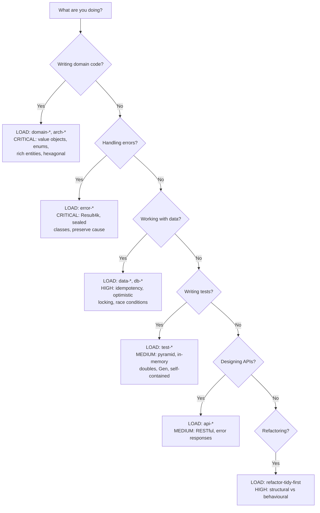

# Kotlin Engineering Skill

## This Project's Stack

These rules are CRITICAL and specific to this codebase. Read them first before any other rules.

- [JSONB Store Pattern](references/rules/stack-jsonb-store.md) — every table is `id UUID, data JSONB`; all stores extend `GeneralStore<T>`
- [http4k Contract Pattern](references/rules/stack-http4k-contract.md) — specs + handlers always separate; lenses in companion object
- [API Models vs DB Models](references/rules/stack-api-models.md) — always two model classes; transform via `toApi()` extension
- [Flyway Migrations](references/rules/stack-flyway-migrations.md) — SQL for schema, Kotlin for data; migration-local data classes only
- [OpenAPI → Frontend Workflow](references/rules/stack-openapi-workflow.md) — **every API change** must be followed by deploy → generate → update FE
- [Serialization](references/rules/stack-serialization.md) — `kotlinx.serialization`; custom serializers for UUID, LocalDateTime, List\<UUID\>

<NON-NEGOTIABLE>
After ANY change to an API contract or response model:
1. Deploy the backend
2. Run the OpenAPI generator
3. Update the frontend with the new generated types

This is not optional. This is not "do it later". Do it as part of the same piece of work.
</NON-NEGOTIABLE>

---

## Overview

Kotlin backend engineering rules for domain modelling, hexagonal architecture, Result4k error handling, and testing. Rules are requirements, not guidelines.

<NON-NEGOTIABLE>
The rules in this skill are REQUIREMENTS, not guidelines.

You do not get to choose which rules to follow. You do not get to adapt them based on "context". You do not get to skip them because "it's just a small change".

Every rule marked CRITICAL or HIGH MUST be followed with ZERO exceptions. Every rule marked MEDIUM MUST be followed unless technically impossible.

If you find yourself thinking "but in this case..." - STOP. You are rationalising. Follow the rule.
</NON-NEGOTIABLE>

## Mandatory Self-Assessment

Before writing ANY Kotlin code, determine which rules apply:

## Rule Index

All rules are in `references/rules/`. Load relevant files based on your current task.

### Domain Models

- [Factory Methods](references/rules/domain-smart-constructors.md) - ID generation, timestamps, defaults
- [Value Objects](references/rules/domain-value-objects.md) - Wrap primitives for type safety
- [Avoid Booleans](references/rules/domain-avoid-booleans.md) - Use enums instead
- [Rich Entities](references/rules/domain-rich-entities.md) - Behaviour in domain objects, not services

### Architecture

- [Hexagonal Architecture](references/rules/arch-hexagonal.md) - Domain has zero infrastructure dependencies
- [Imperative Shell, Functional Core](references/rules/arch-imperative-functional.md) - I/O at edges, pure logic in core
- [DTOs vs Domain Objects](references/rules/arch-dto-vs-domain.md) - DTOs for persistence only

### Error Handling

- [Result4k Basics](references/rules/error-result4k-basics.md) - Result4k for ALL error handling
- [Domain Errors](references/rules/error-domain-errors.md) - Sealed class hierarchies
- [Preserve Cause](references/rules/error-preserve-cause.md) - Preserve exception causes when wrapping

### Data Consistency

- [Idempotency](references/rules/data-idempotency.md) - All operations safe to retry
- [Optimistic Locking](references/rules/data-optimistic-locking.md) - Version numbers for concurrent writes
- [Race Conditions](references/rules/data-race-conditions.md) - Prevent read-modify-write races

### APIs

- [RESTful Design](references/rules/api-restful-design.md) - Resource naming, HTTP methods, status codes
- [Error Responses](references/rules/api-error-responses.md) - Consistent structure, never leak internals
- [API Documentation](references/rules/api-documentation.md) - OpenAPI specs and examples

### Testing

- [Testing Philosophy](references/rules/test-philosophy.md) - Enable refactoring, fast, test behaviour
- [Testing Pyramid](references/rules/test-pyramid.md) - 75-80% unit, 15-25% integration
- [Test Domain Directly](references/rules/test-domain-directly.md) - Test domain entities directly
- [In-Memory Doubles](references/rules/test-in-memory-doubles.md) - In-memory repository implementations
- [Contract Tests](references/rules/test-contract-tests.md) - Fakes and real must both pass
- [No Mocks](references/rules/test-no-mocks.md) - Zero mocks in new tests, refactor existing
- [Self-Contained Scenarios](references/rules/test-self-contained.md) - No @BeforeEach, no shared state
- [Gen for Test Data](references/rules/test-gen-data.md) - Use Gen object
- [Observable Behaviour](references/rules/test-observable-behavior.md) - Assert outcomes, not interactions
- [Edge Cases](references/rules/test-edge-cases.md) - Boundary values, error conditions
- [Extension Functions](references/rules/test-extension-functions.md) - withStatus(), withLineItems()
- [TDD Cycle](references/rules/test-tdd-cycle.md) - Red-green-refactor
- [Test Fixtures](references/rules/test-fixtures.md) - Scenario builders for complex setup
- [Acceptance Scenarios](references/rules/test-acceptance-scenarios.md) - Given/when/then builders
- [TestTransactor](references/rules/test-transactor.md) - Unit testing transactional code

### Databases

- [Persistence Patterns](references/rules/db-persistence.md) - Repository design with Query objects
- [Table Definitions](references/rules/db-table-definitions.md) - Tables as classes, not objects
- [Map Outside Transaction](references/rules/db-map-outside-transaction.md) - Map data outside transaction blocks

### Code Style

- [Naming Conventions](references/rules/style-naming-conventions.md) - Kotlin naming conventions
- [Code Organisation](references/rules/style-code-organisation.md) - Class member ordering, file structure

### Legacy Code

- [Tidy First](references/rules/refactor-tidy-first.md) - Separate structural from behavioural changes

## Rationalisation Protection

When you catch yourself thinking any of these, STOP. You are rationalising:

| Excuse | Reality |
|--------|---------|
| "It's just a small change" | Small violations accumulate into tech debt. Follow the rules. |
| "The existing code doesn't follow this" | You are not the existing code. Follow the rules. |
| "Result4k is overkill here" | Exceptions hide control flow. Result4k is ALWAYS required. |
| "I don't need a value object for this" | Primitives are bugs waiting to happen. Wrap it. |
| "I'll fix it later" | Later never comes. Do it correctly now. |
| "It works, so it's fine" | Working is the minimum bar. Correctness is the standard. |
| "The rule doesn't apply here" | If you're writing Kotlin, the rules apply. No exceptions. |
| "Mocks are faster to write" | Mocks create brittle tests. In-memory doubles last forever. |

## Red Flags

If you observe ANY of these in code you're writing or reviewing, STOP immediately:

**Domain Violations:**
- Raw String, UUID, or BigDecimal in function signatures
- Boolean parameters (should be enums)
- Business logic in services instead of domain objects

**Architecture Violations:**
- Infrastructure imports in domain layer
- Domain objects with persistence annotations

**Error Handling Violations:**
- Throwing exceptions for expected failures
- Catching and swallowing exceptions
- Exception without preserved cause

**Data Consistency Violations:**
- Non-idempotent endpoints
- Missing version fields on mutable entities
- Read-modify-write without locking

**Testing Violations:**
- @BeforeEach with shared mutable state
- Mock verification instead of asserting outcomes
- Mocks in new test files
- In-memory doubles without contract tests

## Enforcement Checklist

See [Checklist](references/rules/_checklist.md) before claiming work is complete.
